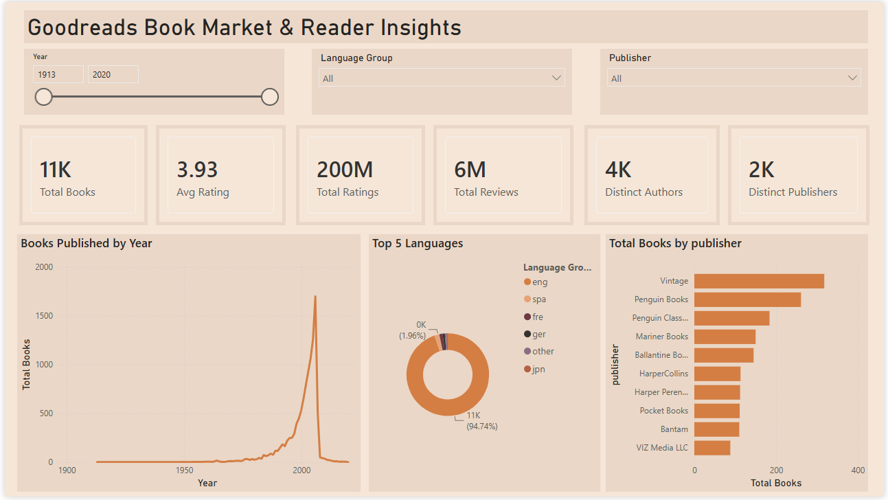
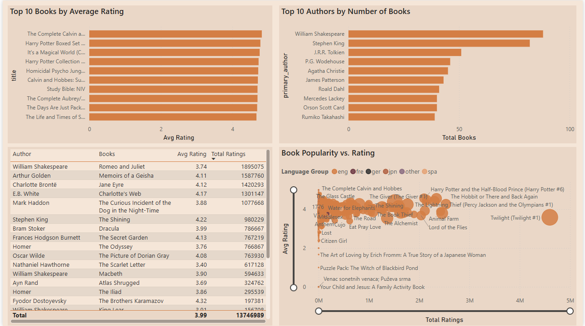
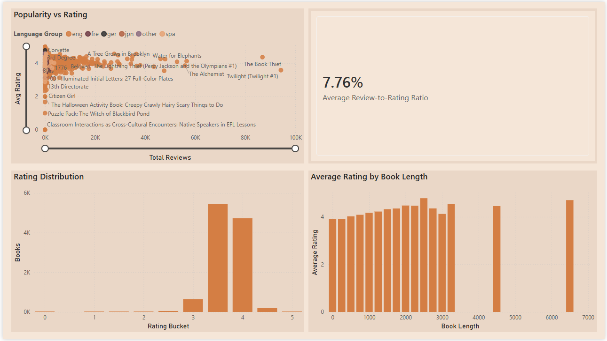
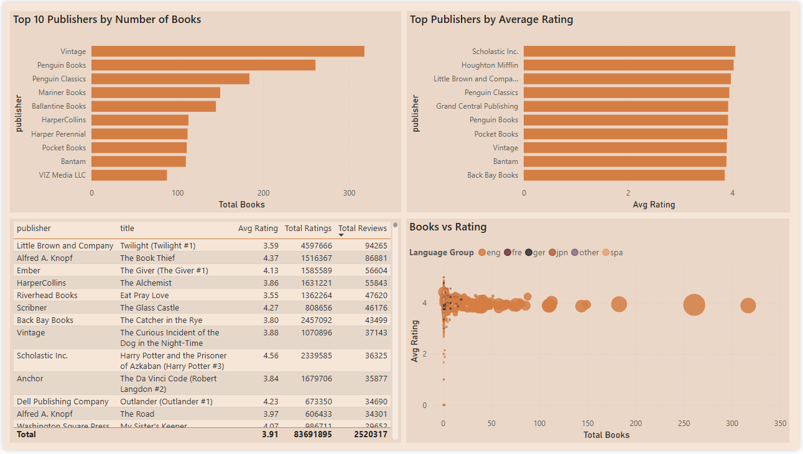

# 1st books-analyst
This repository contains any source to create interactive analytics dashboard that transforms the raw Goodreads book catalog into actionable insights on book performance, publishing trends, and reader engagement, which helps publishers, marketers, or platform teams identify what makes books succeed on the platform

## Page 1 - Overview
This page gives a high-level snapshot of the entire book catalog before diving into specifics. The six KPI cards (Total Books, Avg Rating, Total Ratings, Total Reviews, Distinct Authors, Distinct Publishers) establish scale — how big is this dataset, and what does "typical" look like. The publishing trend line chart shows whether the catalog is growing, shrinking, or plateauing year over year, useful for spotting whether recent data is sparse (which would explain gaps in other pages). The Top 5 Languages donut chart shows market/language concentration at a glance — confirming whether this is a predominantly English-language dataset before any language-based filtering happens downstream. Synced slicers (Year, Language, Publisher) on this page act as the master controls for the whole report, letting a viewer narrow the entire dashboard to a specific era, language, or publisher before exploring further.

## Page 2 — Top Books & Authors
This page answers "what's actually good, and who's making it." The Top 10 Books bar chart surfaces the highest-rated titles, filtered to a minimum ratings count so a book with one 5-star rating can't outrank a book with thousands of genuine reviews. The Top 10 Authors by Book Count chart identifies the most prolific authors in the catalog, which is a different signal from quality — volume, not necessarily excellence. The authors table (filtered to 3+ books) bridges the two: it ranks authors by average rating while excluding one-book outliers, so it reflects consistent quality across a body of work rather than a lucky single title.

## Page 3 - Engagement Analysis

This page moves past "is it rated well" into "how do readers actually engage with it." The ratings-vs-reviews scatter chart is the centerpiece — it shows whether books that accumulate many star ratings also generate proportional written reviews, or whether some books get rated passively without readers bothering to write anything. The Avg Review-to-Rating Ratio card quantifies that same idea as a single benchmark number for the whole catalog. The rating distribution bar chart (using 0.5-point bins) shows how ratings are actually spread — whether most books cluster tightly around 3.5–4.5 (as is typical for Goodreads) or spread more evenly, which affects how meaningful "above average" really is. The page count vs. rating chart tests a specific hypothesis: does book length correlate with reader satisfaction, useful for publishers deciding on manuscript length expectations.

## Page 4 - Publisher Performance
This page shifts the unit of analysis from individual books/authors to publishing houses. The summary table gives a sortable, filterable view of every publisher's book count, average rating, and total ratings — a working reference rather than a ranked headline.